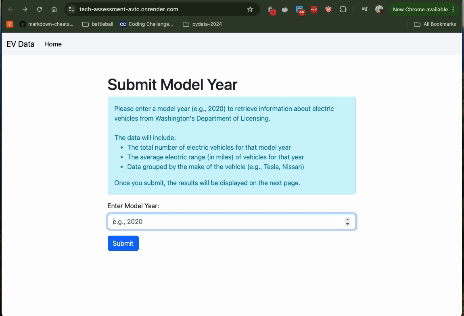

# EV Data FastAPI Assessment

This FastAPI app retrieves and aggregates electric vehicle data from the Washington State Department of Licensing. The app returns the number of vehicles and the average electric range for a specified model year, grouped by vehicle make.

## Hosted app
The current version of the app is hosted here:
https://tech-assessment-avtc.onrender.com/

## Setup Instructions

### 1. Clone the Repository

```bash
git clone git@github.com:Fitzclutchington/tech_assessment.git
cd tech-assessment
```

### 2. Set Up Virtual Environment
```
python -m venv venv

# Activate the virtual environment
# On macOS/Linux:
source venv/bin/activate

# On Windows:
venv\Scripts\activate
```

### 3. Install Dependencies
```
pip install -r requirements.txt
```

### 4. Run the application
```
uvicorn vehicle-query.app:app --reload
```

### 5. Example Usage
To get data for the model year 2020, make a request to:

